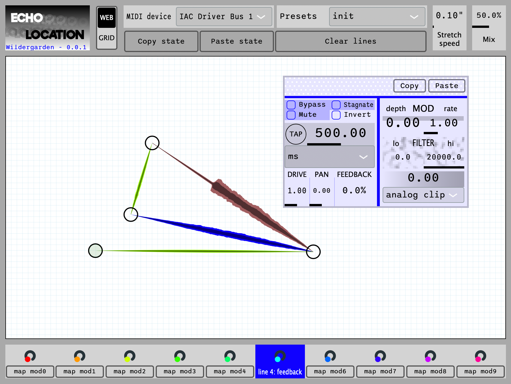

# EchoLocation Delay Lines

*Version 0.0.1 out now!*

Delay lines can be many things: echoes, reverbs, filters, spaces, resonances.
This plugin envisions delay lines as, well, actual lines in a web that can be dragged and stretched like a spiders web,
to let you build these spaces before your very eyes.
As a delay line drags longer, it gets lower in pitch, and vice versa, so dragging the web can send its delays spiraling.

For more information, check out the [manual](docs/Manual.md)